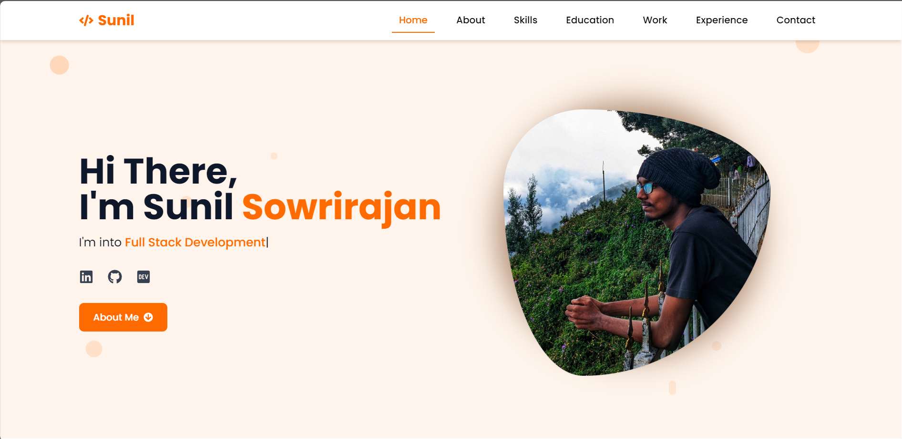

# Portfolio Website

  
*A modern, responsive portfolio showcasing my skills, projects, and experience*

## 🌟 Features

- **Modern UI/UX** with glassmorphism, animated components, and responsive design
- **Interactive Elements** powered by Framer Motion animations
- **Dynamic Content** from structured data files (skills, education, projects)
- **Optimized Performance** with lazy loading, image optimization, and clean code
- **SEO Ready** with proper meta tags and semantic HTML

## 🛠 Technologies Used


## 🚀 Live Demo

Check out the live deployment:  
🔗 [Live Demo](https://sunilsowrirajan.netlify.app/)

## 📂 Project Structure
  ```
    portfolio/
    ├── public/ # Static assets
    ├── src/
    │ ├── components/ # React components
    │ ├── data/ # Content data (skills, education, etc.)
    │ ├── styles/ # Global styles
    │ ├── App.jsx # Main app component
    │ └── main.jsx # Entry point
    ├── package.json
    └── README.md
  ```

## 🛠 Installation & Setup

1. **Clone the repository**
   ```bash
   git clone https://github.com/yourusername/portfolio.git
   cd portfolio
   ```
2. **Install dependencies**
   ```
   npm install
   ```
3. **Run development server**
   ```
   npm run dev
   ```
4. **Build for production**
   ```
   npm run build
   ```

## 🎨 Customization Guide

1. **Update Personal Information**
Modify the data files in src/data/:

- skills.js - Your skills and proficiency levels
- education.js - Education history
- projects.js - Portfolio projects

2. **Change Styling**
- Edit the Tailwind CSS configuration in tailwind.config.js

3. **Add New Sections**
- Create new components in src/components/ and import them into App.jsx

## 🌐 Deployment

This project is configured for easy deployment on Netlify:

- Push your code to a GitHub repository
- Connect the repo to Netlify
- Set build command: npm run build
- Set publish directory: dist

Netlify will automatically deploy your site on push!

## 📬 Contact
For feedback or collaboration, reach out at: suniltechy@gmail.com
  #### [🔗 LinkedIn](https://www.linkedin.com/in/sunil-sowrirajan-40548826b/)

Made with ❤️ by Sunil Sowrirajan
   
   
   
